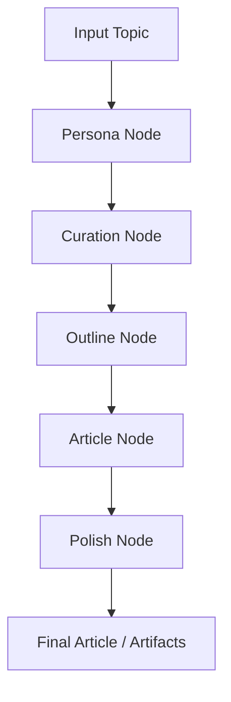
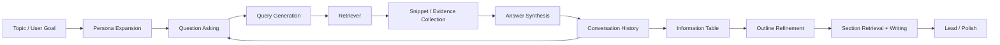
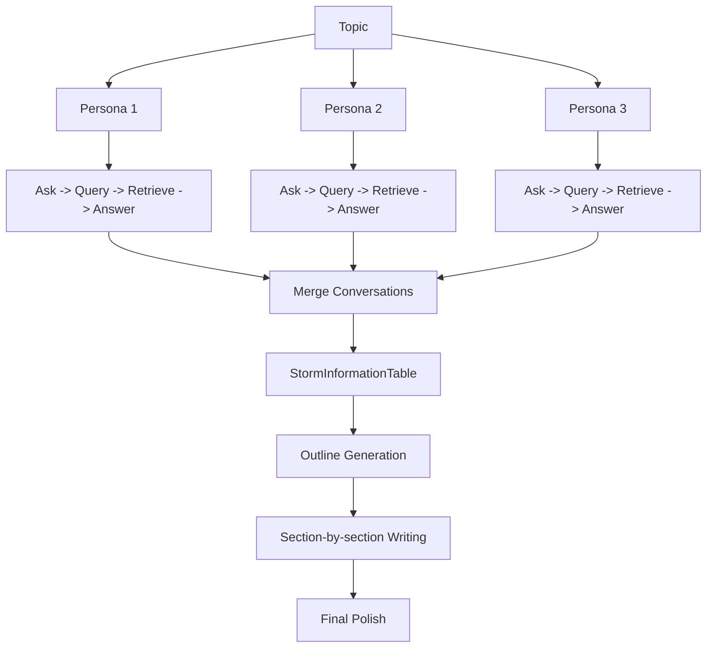
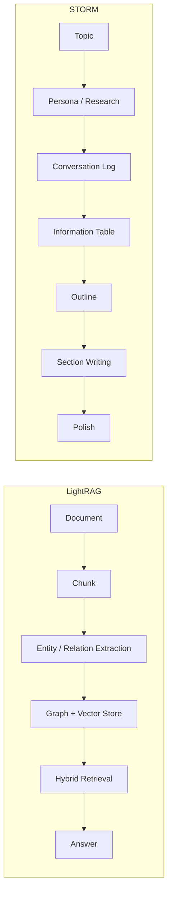

# STORM LangGraph 流程图

## 1. 总体 LangGraph 流程

## 2. RAG / Research 主链

## 3. 并行 Agent 结构

STORM 的“并行”更准确地说是多 persona research 并行，而不是多个完全独立的大模型随意互聊。

## 4. 和 LightRAG 思路的差异

## 5. 当前 demo 的运行方式

运行文件：

- `storm_langgraph/demo/run_demo.py`

运行后会产出：

- `storm_langgraph/demo_output/demo_article.txt`
- `storm_langgraph/demo_output/demo_state.json`

